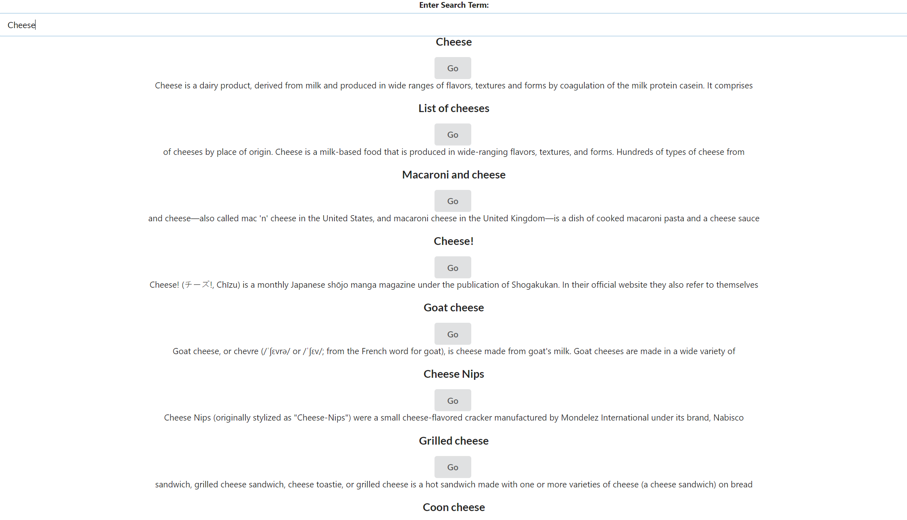

# Widget

I will be building a Widget application that will include multiple components. These components will be:

- An Accordion component

- A Wikipedia API search component

- A Dropdown item selection component

- A Google Translate API component

I will then wrap up the Widget application by building my own navigation using JS and React without a third-party library like React Router. This will be used to navigate between the different widget components that were built.

### 4/23/2021

Working Search Working
Still more work to be done and need to finish off some styling. Most functionality is up and running.

###### Took some time on other projects. Starting back up again

